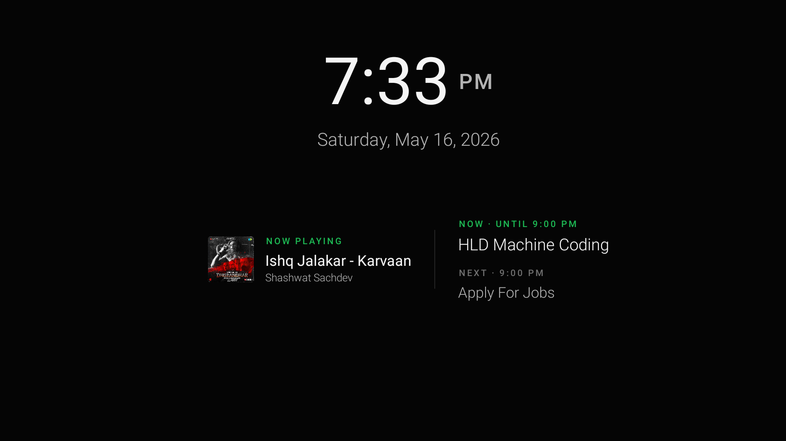
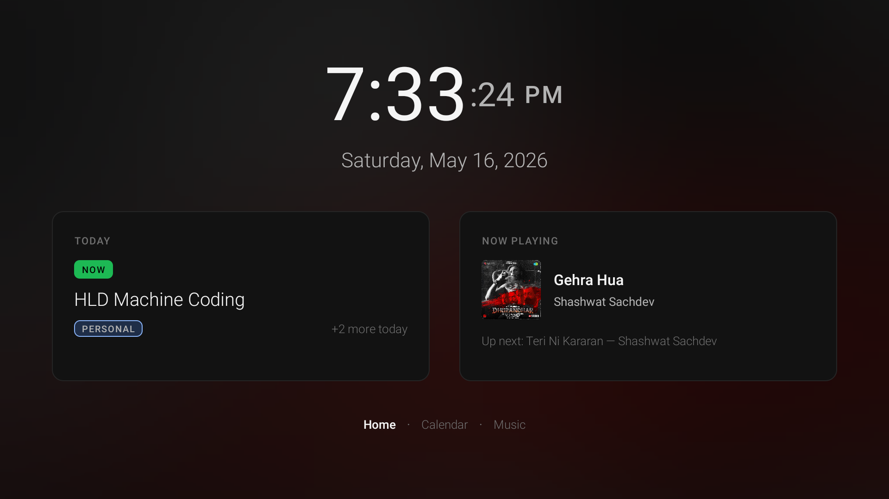
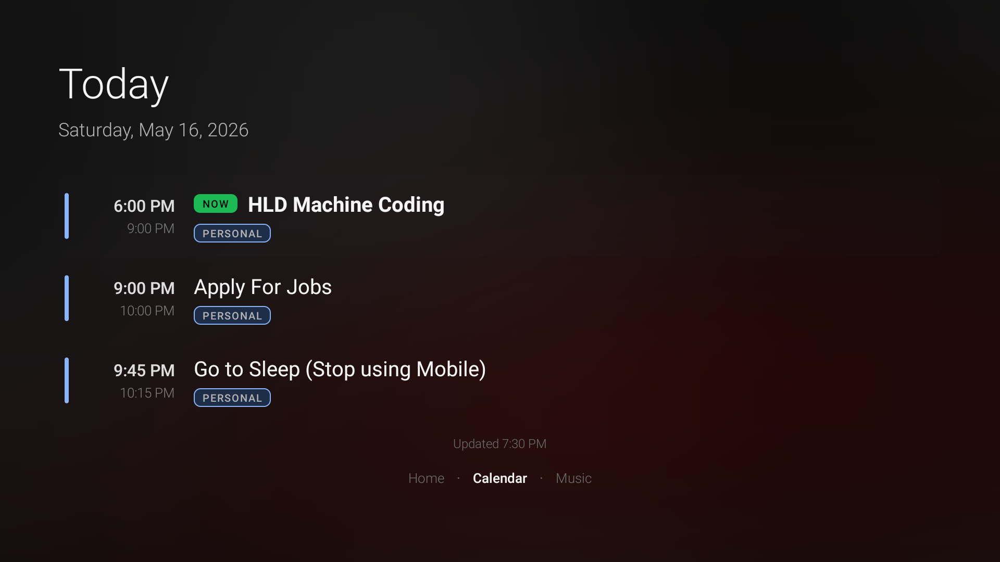
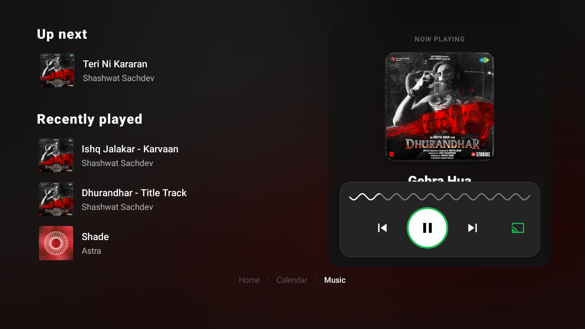

# Fire TV Ambient Dock

> The always-on control panel for your desk. Plug a Fire TV into a spare monitor and turn that dusty second screen into the calmest, most useful surface in your setup.



You already have a laptop for the thing you're focused on. You already have a phone for the world reaching in. **You're missing the third screen** — the one that just *sits there* and tells you the time, what meeting is next, and what's playing, without ever asking for a click.

This is that screen.

---

## What you get

### A clock you actually want to look at

A huge, thin, beautifully kerned time display — with seconds that quietly fade away after 90 seconds of stillness so the resting face is just `7:33 PM`. When idle, the whole dashboard melts away into a true-black screensaver and the clock drifts a few pixels every minute so your panel never burns in.



### Your calendar, at the exact moment you need it

The dashboard shows what's happening *now* and what's next. Walk past the screen and you instantly know: *"keep coding"* or *"stand up, meeting in five"*. Tap into the Calendar page for the full timeline of the day — personal and work feeds merged from your Google / Outlook iCal URLs, colour-tagged.



### A remote control for Spotify, on your wall

The Music page is a full-blown Spotify Connect remote: album art, transport buttons, your live queue, your recently played tracks — driven by the actual MediaSession on your TV plus the Spotify Web API. Skip from across the room with the Fire TV remote. Switch playback to your headphones, your kitchen speaker, your living-room TV, all from one focus ring.



### A background that actually breathes

Every screen carries a softly blurred wash of the current track's album art — Gaussian-quality, no pixel grid, no harsh edges. When you stop touching the remote, the wash fades to black so the clock owns the room.

### NEW: mirror your phone, your laptop, your whole damn meeting

The dock now doubles as a wireless display. Flip the **Phone mirroring** switch in Settings and the Fire TV starts advertising itself on your network as a target for:

- **AirPlay** — iPhone, iPad, MacBook
- **Google Cast** — Chrome, Android, any Cast-aware app
- **Miracast** — Windows, Android phones without Cast

The dashboard stays calm at rest. The moment a sender connects, it crossfades out, your phone or laptop takes the screen edge-to-edge, and a small *"Casting from {your device} via AirPlay"* pill rests in the top-right corner. When the sender disconnects, the dock fades right back. No app switching, no input picker — just press AirPlay on your laptop and you're on the big screen in a second.

A few quiet touches:

- Long-press **BACK** during a session to drop back to the dashboard *without* killing the sender — the pill follows you home until you actually disconnect.
- That pill drifts a few pixels every minute. Same burn-in protection logic the ambient clock uses.
- Each protocol is its own toggle, so you can leave AirPlay on but turn off Cast / Miracast advertisements if you only ever mirror from Apple stuff.
- Off by default. The dashboard is the headline; mirroring is the quiet superpower behind it.

---

## Why this exists

Most "TV dashboards" out there are either repurposed weather apps, screen-saver photo frames, or someone's home-assistant panel from 2019. None of them sit *gracefully* in an engineer's workspace.

This one does. It's built for the specific moment when you're heads-down in code, you hear a song you love, you glance up, and you want to know — in one beat — *what is this, how long do I have until my next call, am I still on track?* No app, no tab, no notification. Just a calm second screen that already knew.

Side benefits:

- **Stay awake** while visible (no screen-off mid-meeting)
- **Sleep timer** so it gracefully exits after you go to bed
- **Burn-in protection** for OLED panels (clock drifts in ambient mode)
- **Fire TV native** — uses the remote, the D-pad, the media keys exactly as you'd expect
- **No cloud, no telemetry, no account required** (Spotify connection is optional and PKCE-based)

---

## Get it running in 5 minutes

### 1. Build & sideload

```bash
source scripts/dev-env.sh
cp local.properties.example local.properties   # set sdk.dir and spotify.clientId
./gradlew assembleFiretvDebug
adb install -r app/build/outputs/apk/firetv/debug/app-firetv-debug.apk
```

Fire TV is the default; for Google TV / Android TV use `assembleGoogletvDebug` instead — same code, separate minSdk + applicationId so you can leave both installed if you bounce between devices.

`spotify.clientId` comes from the [Spotify Developer Dashboard](https://developer.spotify.com/dashboard). Redirect URI: `com.ambient.tvclock://spotify-callback`. Add your Spotify account under **User Management** (Development Mode).

### 2. Point it at your calendar

Google Calendar → your calendar → **Integrate calendar** → **Secret address in iCal format**. On the TV: **Settings → Personal calendar URL** — paste the link. Or from your Mac:

```bash
./scripts/set-calendar-urls.sh 192.168.1.4:5555 "https://calendar.google.com/calendar/ical/.../basic.ics"
```

Work Outlook ICS goes under **Work calendar URL**.

### 3. Let it see your music

Grant the notification listener so it can read MediaSession metadata from the Spotify TV app:

```bash
LISTENER=com.ambient.tvclock.firetv/com.ambient.tvclock.MediaNotificationListener
adb shell settings put secure enabled_notification_listeners $LISTENER
adb shell cmd notification allow_listener $LISTENER
```

Or just run `./scripts/install-firetv.sh` — it does all three steps in one shot.

### 4. (Optional, Premium) Spotify queue + transport

1. Add `spotify.clientId` to `local.properties` and rebuild
2. **Settings → Connect Spotify** — sign in on the TV (WebView)
3. Play Spotify on the same account; the Fire TV must be the active Connect device for queue data
4. On **Music**, focus a transport button or a track row and press **OK**
5. Focus **Playing on … · OK to switch** to move playback to another device

### 5. (Optional) Turn on phone mirroring

**Settings → Phone mirroring (beta) → Enable mirroring receiver.** Set a device name if you want one in the AirPlay picker. Each protocol (AirPlay / Cast / Miracast) is independently toggleable, so you can advertise only what your senders actually use. The dock will start a small foreground service that advertises on the LAN; flip it off and everything goes back to sleep.

---

## How to use it

| Input | Where | What it does |
|---|---|---|
| D-pad Left / Right | Anywhere | Switch between Home, Calendar, Music |
| D-pad Up / Down | Calendar | Scroll the day |
| D-pad / OK | Music | Focus + activate transport, tracks, device switcher |
| Media keys | Music | Play/pause, skip, previous (works with Fire TV remote media buttons) |
| Menu / Settings | Anywhere | Settings (calendar URLs, Spotify, ambient timing, sleep timer) |

After your configured idle window (default 90s) the dashboard fades into ambient mode — clock + a single horizontal music ⨯ calendar strip below it. Any keypress brings it back.

---

## Capture screenshots

```bash
mkdir -p screenshots
adb exec-out screencap -p > screenshots/$(date +%Y%m%d-%H%M%S).png
```

---

## Under the hood

- `MainActivity.kt` — dashboard pager, drift, ambient watchdog, input routing, streaming-overlay crossfade
- `HomeScreenBinder.kt` / `CalendarScreenBinder.kt` / `MusicScreenBinder.kt` — per-screen view binders
- `BlurredBackgroundBinder.kt` + `AlbumArtBlur.kt` — full-bleed artwork wash (pyramid downsample + 3-pass box blur ≈ Gaussian, plus a GPU `RenderEffect` pass on API 31+)
- `CalendarPoller.kt` / `IcalParser.kt` — iCal feed polling, every 15 min
- `SpotifyApiClient.kt` / `SpotifyAuthActivity.kt` — OAuth PKCE + queue/recently-played
- `NowPlayingPoller.kt` — MediaSession bridge
- `receiver/ReceiverService.kt` — foreground service hosting AirPlay / Google Cast / Miracast advertisements, plus the RTSP + MediaCodec pipeline for the AirPlay video stream
- `receiver/ui/StreamingOverlay.kt` — full-bleed SurfaceView that the dashboard crossfades into when a sender connects

Built on plain Android views (no Compose, no React Native) so it stays buttery on older Fire TV hardware.

---

*If you've got a spare monitor and a Fire TV stick in a drawer somewhere, give this 5 minutes. It's the kind of small infrastructure you don't realise was missing from your desk until it's there.*
