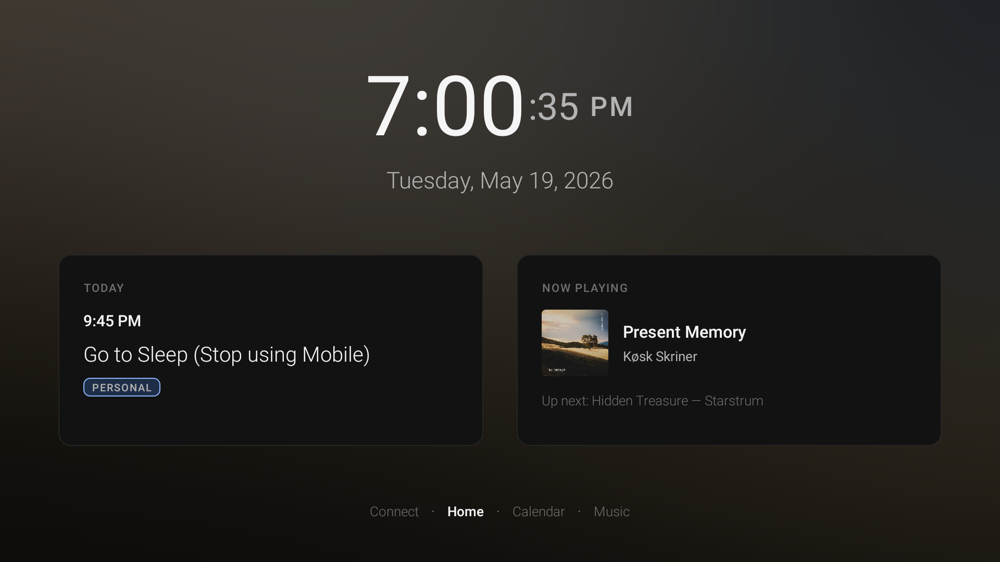
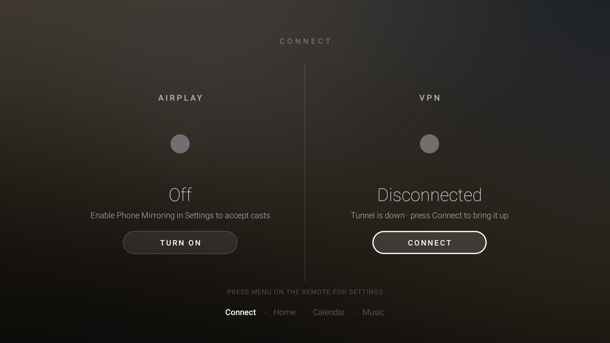
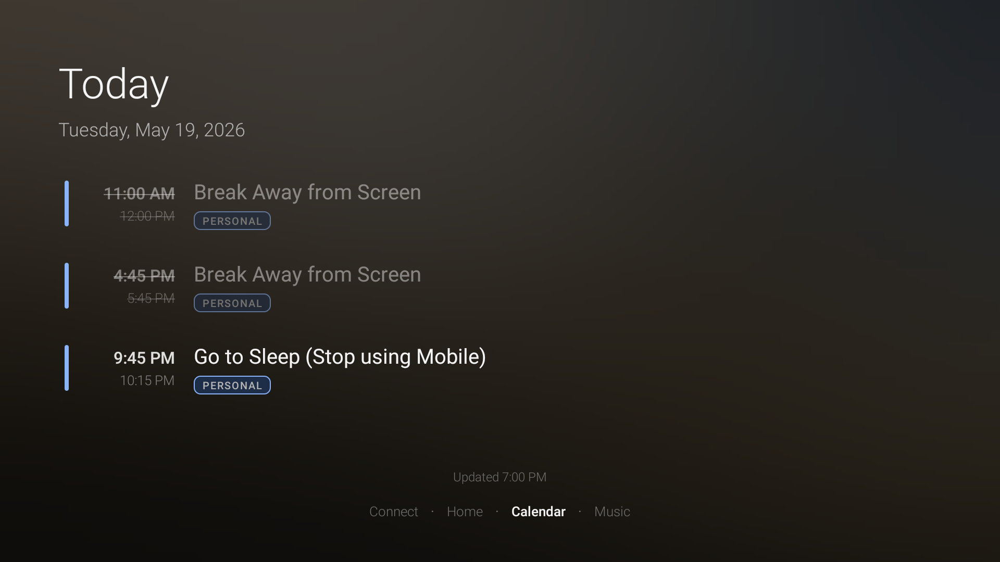
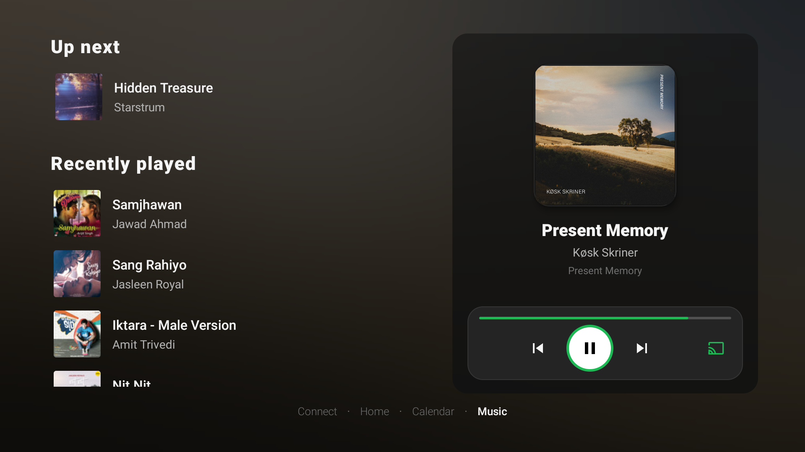
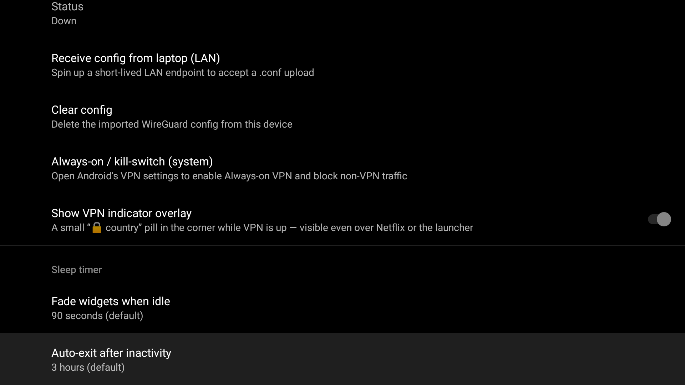
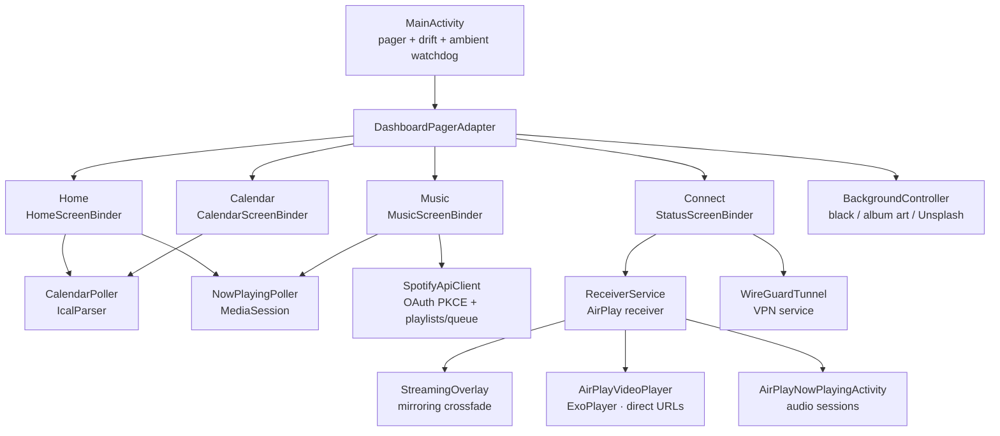

<h1 align="center">Dock</h1>

<p align="center">
  <em>The always-on ambient screen your desk was missing.</em>
</p>

<p align="center">
  <a href="https://github.com/the-mrinal/Dock/releases/latest"></a>
  <a href="LICENSE"></a>
  <a href="https://github.com/the-mrinal/Dock/stargazers"></a>
  
</p>

<p align="center">
  <strong><a href="https://dock.mrinal.dev">Website</a></strong>
  · <a href="https://github.com/the-mrinal/Dock/releases/latest">Download APK</a>
  · <a href="CONTRIBUTING.md">Contributing</a>
  · <a href="#how-it-works">How it works</a>
</p>

<p align="center">
  
</p>

> Plug any Android TV device into a spare monitor and turn that dusty second screen into the calmest, most useful surface in your setup.

You already have a laptop for the thing you're focused on. You already have a phone for the world reaching in. **You're missing the third screen** — the one that just *sits there* and tells you the time, what meeting is next, and what's playing, without ever asking for a click.

This is that screen.

---

## Contents

- [Features](#features)
- [Screenshots](#screenshots)
- [Quick start](#quick-start)
- [Configuration](#configuration)
- [How it works](#how-it-works)
- [Releasing](#releasing)
- [Contributing](#contributing)
- [License](#license)
- [Acknowledgements](#acknowledgements)

---

## Features

### A clock you actually want to look at

A huge, thin, beautifully kerned time display — with seconds that quietly fade away after 90 seconds of stillness so the resting face is just `7:00 PM`. When idle, the whole dashboard melts into ambient mode — clock plus a single thin music × calendar strip — and the clock drifts a few pixels every minute so your panel never burns in.

### Your calendar, at the exact moment you need it

The dashboard shows what's happening *now* and what's next. Walk past the screen and you instantly know: *"keep coding"* or *"stand up, meeting in five."* Tap into the **Calendar** page for the full timeline — personal + work feeds merged from your Google / Outlook iCal URLs, colour-tagged, refreshed every 15 minutes.

### A remote control for Spotify, on your wall

The **Music** page is a full-blown Spotify Connect remote, driven by the actual MediaSession on your TV plus the Spotify Web API:

- **Browse your library** — your own playlists (Spotify-curated mixes filtered out), **Liked Songs**, and your recently played tracks, all in a D-pad-friendly list. Drill into a playlist and press OK on any track — it plays *in that playlist's context*, so the queue keeps flowing.
- **Transport from the couch** — album art, play/pause, skip, previous, and a live **Up next** card, all reachable with the Android TV remote.
- **Send playback anywhere** — switch the active device to your headphones, kitchen speaker, or living-room TV from one focus ring.

### AirPlay receiver — mirror, video, and music

Flip the switch in Settings and the dock advertises itself on your network as an **AirPlay** target for your iPhone, iPad, or Mac. The dashboard stays calm at rest; the moment a sender connects, it crossfades out and the stream takes the screen. Three session types, each handled natively:

- **Screen mirroring** — hardware H.264 decode straight to the panel, letterboxed correctly for portrait phones. A small *"Casting from {device} via AirPlay"* pill rests in the corner, drifting a few pixels every minute (same burn-in protection as the clock).
- **Video apps** — apps that hand off a direct stream URL (YouTube and friends) play through ExoPlayer with HLS support instead of lossy mirroring.
- **Audio** — play Apple Music or Spotify from your phone and the dock decodes the ALAC stream (software decoder included for picky hardware) and shows a full-screen **Now Playing** view: blurred artwork, track metadata, and a smooth progress bar, with the screen kept awake.

**Google Cast** and **Miracast** toggles exist in Settings, but those receivers are scaffolding for now — AirPlay is the protocol that actually works today. Track the roadmap in the issues.

### WireGuard VPN, baked in

The dock ships with a native WireGuard tunnel. Drop a `.conf` from your laptop over the LAN, tap **Connect** on the **Connect** page, and every byte the TV sends goes through the tunnel — Netflix, Plex, the launcher, everything. A discreet country pill confirms the tunnel is up. The system "Always-on / kill-switch" hook is one tap away so non-VPN traffic gets blocked at the kernel.

### A background that breathes

Pick what the screen rests on: **true black** (OLED-friendly), a softly blurred wash of the current track's **album art** (pyramid downsample + 3-pass box blur, GPU `RenderEffect` on API 31+), or **Unsplash wallpapers** matched to your keywords and shuffled on a timer. Idle and playing states get independent choices — album art while music plays, black when the room goes quiet.

### Quietly good behaviour

- **Stay awake** while visible — no screen-off mid-meeting
- **Inactivity timeout** so the dock gracefully exits when you go to bed (30 min – 8 h, or never)
- **Burn-in protection** for OLED panels — clock and casting pill drift in ambient mode
- **Android TV native** — uses the remote, D-pad, and media keys exactly as you'd expect
- **No cloud, no telemetry, no account required** — Spotify is optional and PKCE-based

---

## Screenshots

<table>
  <tr>
    <td align="center" width="50%">
      <a href="screenshots/home.png"></a><br>
      <sub><b>Home</b> — clock, today's events, now-playing, pager dots</sub>
    </td>
    <td align="center" width="50%">
      <a href="screenshots/connect.png"></a><br>
      <sub><b>Connect</b> — AirPlay receiver and WireGuard VPN, side by side</sub>
    </td>
  </tr>
  <tr>
    <td align="center" width="50%">
      <a href="screenshots/calendar.png"></a><br>
      <sub><b>Calendar</b> — the day on one screen, with personal/work tags</sub>
    </td>
    <td align="center" width="50%">
      <a href="screenshots/music.png"></a><br>
      <sub><b>Music</b> — playlist browser, transport, up next</sub>
    </td>
  </tr>
  <tr>
    <td align="center" colspan="2">
      <a href="screenshots/settings-vpn.png"></a><br>
      <sub><b>Settings · VPN</b> — config import over LAN, kill-switch shortcut, indicator overlay</sub>
    </td>
  </tr>
</table>

---

## Quick start

### Option 1 — install the pre-built APK (5 minutes)

1. Grab the latest APK for your platform from the [Releases](https://github.com/the-mrinal/Dock/releases/latest) page (`app-firetv-release-*.apk` or `app-googletv-release-*.apk`).
2. Enable ADB on your TV (Fire OS: Settings → My Fire TV → Developer Options. Google TV: Settings → System → About → tap *Android TV OS build* 7×, then Developer options → USB debugging).
3. From your laptop:
   ```bash
   adb connect <tv-ip>:5555
   adb install -r app-firetv-release-vX.Y.Z.apk      # or app-googletv-release-vX.Y.Z.apk
   ```
4. Launch **Dock** from the Apps row.

> APK builds are produced manually per release (see [Releasing](#releasing) for the why) — not every release has APKs attached. If yours doesn't, build from source below or run `gh workflow run package.yml -f tag=<latest>` on your fork.

### Option 2 — build from source

```bash
source scripts/dev-env.sh
cp local.properties.example local.properties   # set sdk.dir, spotify.clientId, unsplash.accessKey
./gradlew assembleFiretvDebug
adb install -r app/build/outputs/apk/firetv/debug/app-firetv-debug.apk
```

The `firetv` build flavor is the default and targets `minSdk 25` (older Amazon Fire OS hardware still ships there). For newer Google TV / Android TV / Chromecast devices, use `./gradlew assembleGoogletvDebug` — same code, `minSdk 29`, separate `applicationId` so both can coexist on one device.

`spotify.clientId` comes from the [Spotify Developer Dashboard](https://developer.spotify.com/dashboard). Redirect URI: `com.ambient.tvclock://spotify-callback`. Add your Spotify account under **User Management** (Development Mode).

`unsplash.accessKey` comes from [Unsplash Developers](https://unsplash.com/developers) — create an app, copy the **Access Key** (not Secret Key). Drives the Unsplash background mode. Free Demo tier is 50 req/hr, which the dock stays well under because one search returns a page of 30 URLs that get cycled locally.

For signed release builds, run `./scripts/setup-signing.sh` once to create a keystore and wire the `signing.*` keys into `local.properties`.

---

## Configuration

### Calendar

Google Calendar → your calendar → **Integrate calendar** → **Secret address in iCal format**. On the TV: **Settings → Personal calendar URL** — paste the link. Or, from your Mac:

```bash
./scripts/set-calendar-urls.sh 192.168.1.4:5555 "https://calendar.google.com/calendar/ical/.../basic.ics"
```

Work Outlook ICS goes under **Work calendar URL**.

### Spotify

Grant the notification listener so the dock can read MediaSession metadata from the Spotify TV app:

```bash
LISTENER=com.ambient.tvclock.firetv/com.ambient.tvclock.MediaNotificationListener
adb shell settings put secure enabled_notification_listeners $LISTENER
adb shell cmd notification allow_listener $LISTENER
```

Or just run `./scripts/install-firetv.sh` — it does all three steps in one shot.

For **Premium** users who want the playlist browser, queue, and remote transport:

1. Add `spotify.clientId` to `local.properties` and rebuild
2. **Settings → Connect Spotify** — sign in on the TV (WebView)
3. Play Spotify on the same account; this TV must be the active Connect device for queue data
4. On the Music page: D-pad **Up/Down** walks the browse list (Recently Played, Playlists, Liked Songs), **OK** drills in or plays, **Back** pops out, **Right** jumps to the transport controls
5. Focus **Playing on … · OK to switch** to move playback to another device

### Phone mirroring (AirPlay)

**Settings → Phone mirroring (beta) → Enable mirroring receiver.** Set a device name if you want a custom one in the AirPlay picker, and optionally require a **PIN** for pairing. **Start on boot** keeps the receiver available without opening the app. The dock starts a small foreground service that advertises on the LAN; flip it off and everything goes back to sleep.

Cast and Miracast toggles are present but those receivers aren't functional yet — AirPlay is the supported protocol today.

### WireGuard VPN

The dock spins up a short-lived LAN endpoint that accepts a `.conf` upload from your laptop's browser:

```
Settings → VPN → Receive config from laptop (LAN)
```

To activate, head to the **Connect** page and press **OK** on the VPN card. The kill-switch lives one tap away under **Settings → VPN → Always-on / kill-switch (system)**.

### Backgrounds

**Settings → Background.** Choose independent sources for **idle** and **playing** states (black / album art / Unsplash), toggle the blur, pick Unsplash keyword presets or type your own, and set the shuffle interval (default 10 min — or press **Shuffle photo now**). Keyword changes are rate-limited to once per 2 hours to stay inside Unsplash's demo-tier quota.

### Sleep

**Settings → Sleep.** **Ambient delay** (default 90 s) controls how long until the dashboard fades to the clock-only ambient face. **Inactivity timeout** (default 3 h) exits the app entirely after a long stretch with no remote input — set it to *never* for a true always-on installation.

### Inputs

| Input | Where | What it does |
|---|---|---|
| D-pad Left / Right | Anywhere | Switch between Connect, Home, Calendar, Music |
| D-pad Up / Down | Calendar, Music | Scroll the day / walk the browse list |
| D-pad / OK | Music, Connect | Drill into playlists, play tracks, switch devices, activate AirPlay / VPN |
| Back | Music | Pop out of a playlist back to the browse list |
| Media keys | Music | Play/pause, skip, previous (works with the Android TV remote media buttons) |
| Menu | Anywhere | Settings |

After your configured idle window (default 90s) the dashboard fades into ambient mode — clock plus a single horizontal music × calendar strip below it. Any keypress brings it back.

---

## How it works



- `MainActivity.kt` — dashboard pager, drift, ambient watchdog, input routing, streaming-overlay crossfade
- `Home/Calendar/Music/StatusScreenBinder.kt` — per-page view binders
- `BackgroundController.kt` + `BlurredBackgroundBinder.kt` + `AlbumArtBlur.kt` — background source switching and the full-bleed artwork wash (pyramid downsample + 3-pass box blur ≈ Gaussian, GPU `RenderEffect` pass on API 31+); `UnsplashBackgroundSource.kt` for wallpaper mode
- `CalendarPoller.kt` / `IcalParser.kt` — iCal feed polling, every 15 min
- `SpotifyApiClient.kt` / `SpotifyPlaylistRepository.kt` / `SpotifyAuthActivity.kt` — OAuth PKCE, playlist/Liked Songs browsing, queue, recently played, device transfer
- `NowPlayingPoller.kt` — MediaSession bridge
- `receiver/ReceiverService.kt` — foreground service hosting the AirPlay receiver: mDNS advertisement, pairing, RTSP handshake, and the MediaCodec mirroring pipeline
- `receiver/airplay/AirPlayVideoPlayer.kt` — ExoPlayer (HLS) playback for direct video-URL sessions
- `receiver/airplay/AirPlayNowPlayingActivity.kt` + `AlacSoftwareDecoder.kt` — full-screen Now Playing for audio sessions, with software ALAC decode
- `receiver/ui/StreamingOverlay.kt` — full-bleed SurfaceView the dashboard crossfades into when a sender mirrors
- `vpn/` — WireGuard tunnel manager + the LAN config-import endpoint

Built on plain Android views (no Compose, no React Native) so it stays buttery on older Android TV hardware.

---

## Releasing

This project uses [semantic-release](https://semantic-release.gitbook.io/semantic-release) driven by [Conventional Commits](https://www.conventionalcommits.org/).

- Every PR title is a Conventional Commit (`feat:`, `fix:`, `perf:`, …)
- Releases are cut **locally** with the `/release` Claude Code skill or `npx semantic-release --no-ci` — no CI cost
- Building and attaching APKs is a separate `workflow_dispatch` step: `gh workflow run package.yml -f tag=vX.Y.Z`

See [`CONTRIBUTING.md`](CONTRIBUTING.md) for the full release flow and commit conventions.

---

## Contributing

Pull requests welcome. Read [CONTRIBUTING.md](CONTRIBUTING.md) before opening one — there's a small but firm set of conventions around commit messages, scope, and "what won't be merged" (cloud deps, telemetry, interruptive features). For bugs and feature ideas, use the [issue templates](.github/ISSUE_TEMPLATE).

---

## License

[Apache License 2.0](LICENSE). The patent grant matters for the WireGuard, AirPlay, and codec code paths — please don't strip the LICENSE if you fork.

---

## Acknowledgements

- [WireGuard for Android](https://git.zx2c4.com/wireguard-android/) — `com.wireguard.android:tunnel`
- [AndroidX Media3 / ExoPlayer](https://developer.android.com/media/media3) — direct video-URL playback with HLS
- [dd-plist](https://github.com/3breadt/dd-plist) — Apple plist parsing for AirPlay session attributes
- [OkHttp](https://square.github.io/okhttp/) and [Bouncy Castle](https://www.bouncycastle.org/) — networking + crypto
- [Timber](https://github.com/JakeWharton/timber) — logging
- [Spotify Web API](https://developer.spotify.com/documentation/web-api) — playlists, queue, device control
- The screen-saver photo frames of the world — for being almost-but-not-quite what I wanted

---

<p align="center">
  <sub>If you've got a spare monitor and an Android TV stick in a drawer somewhere, give this five minutes.</sub><br>
  <sub>It's the kind of small infrastructure you don't realise was missing from your desk until it's there.</sub>
</p>
